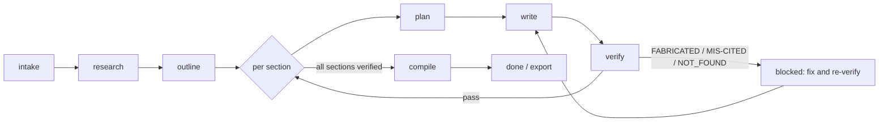

<p align="center">
  
</p>

<p align="center">
  <strong>Turn an assignment prompt into a fully-sourced draft — where every citation is re-fetched and checked against its live source before a single section can ship.</strong>
</p>

<p align="center">
  <a href="https://github.com/ZeusCraft10/pensmith/actions/workflows/ci.yml"></a>
  <a href="LICENSE"></a>
  =20.10">
  
  
</p>

<p align="center">
  <a href="#why-pensmith">Why</a> ·
  <a href="#how-it-works">How it works</a> ·
  <a href="#the-citation-verifier">The verifier</a> ·
  <a href="#install">Install</a> ·
  <a href="#quick-start">Quick start</a> ·
  <a href="#command-reference">Commands</a> ·
  <a href="#configuration">Configuration</a>
</p>

---

Pensmith guides you through a complete paper-writing workflow — **intake → research → outline → (plan → write → verify, per section) → compile → done** — drawing only on verifiable, peer-reviewed, and configurable academic sources. It ships as **two tiers that share the same workflow files**: a [Claude Code](https://claude.com/claude-code) plugin (Tier 1, which generates through your Claude session) and a portable Node.js CLI (Tier 2, which talks to a provider of your choice).

The thing that makes Pensmith different from "ask an AI to write my paper": **a section physically cannot leave the pipeline with a fabricated, mis-attributed, or unverifiable citation.** That gate is deterministic, runs per section, and blocks compile and export.

## Why Pensmith

- 📚 **Citations verified against the live source — not just generated.** Every cited DOI is re-fetched and the author/title are fuzzy-matched against what actually published. Fabricated DOIs, mismatched attributions, and quotes that don't appear in the source are flagged and **block the section**. See [The citation verifier](#the-citation-verifier).
- 🧩 **A paper is a project; a section is a phase.** Each section gets its own isolated `.paper/sections/<N>/` workspace (plan, draft, verification). Re-doing section 3 never touches sections 1, 2, 4, or 5 — state isolation is enforced by directory structure, not careful prompting.
- 🔎 **Real research, real sources.** Discovery fans out across OpenAlex, Crossref, arXiv, PubMed, and Unpaywall, then deduplicates and ranks candidates into a sourced research map. Section writers only ever see their own mapped sources.
- 🎯 **One command.** `/pensmith` reads your paper's state and dispatches the next step. Everything else is a power-user fallback.
- 🪪 **Honest by design.** No metadata or fingerprint is stamped into exported documents. The AI-likelihood transparency check reports a score for your own awareness — it never promises your writing will get past a detector. [Style Match](#style-match) is opt-in and openly dual-use.
- 🔒 **Safe by default.** Outbound requests run through a single audited HTTP chokepoint with SSRF protection; PII is redacted before any model call; network access is **off by default** (tests run against committed cassettes). API keys are never logged.
- 📄 **Compile & export.** Verified sections assemble into a single document and export to **DOCX / PDF / LaTeX / Markdown**, with citation rendering in 8 styles.

## How it works



Approval gates sit at **outline** (you approve the structure before drafting) and **export** (you confirm before a document is written). Both default on; only `--yolo` skips them.

## The citation verifier

This is the load-bearing feature. After a section is drafted, a three-pass verifier runs **bounded to that section**:

| Pass | What it checks | Verdict | Blocking? |
|------|----------------|---------|-----------|
| **Pass 1 — integrity** | Re-fetches each cited DOI from the live source; fuzzy-matches author **and** title (DOI resolving is necessary but not sufficient) | `FABRICATED` / `MIS-CITED` | ✅ blocks |
| **Pass 3 — quote** | Confirms every quoted span exists verbatim in the cited source | `NOT_FOUND` | ✅ blocks |
| **Pass 2 / Pass 4 — judgment** | LLM-assisted claim-support and coherence review | advisory notes | ⚠️ never auto-blocks |

A section carrying a blocking verdict cannot be compiled or exported. The deterministic passes (1 and 3) are the gate; the advisory passes (2 and 4) surface things a human should look at without ever silently failing the build. Edits made after verification are detected via a draft-hash check, so a stale "verified" stamp can't sneak through.

## Install

> **Pre-release.** Pensmith is `v0.1.0-dev`. It is **not yet on npm** and the plugin marketplace listing isn't published — so install from source for now. Published npm + Claude plugin distribution is on the roadmap.

```bash
git clone https://github.com/ZeusCraft10/pensmith.git
cd pensmith
npm install
npm run build
```

Requires **Node.js ≥ 20.10.0**.

**Tier 1 — Claude Code plugin (recommended)**

From a Claude Code session, register your local checkout as a plugin marketplace and install it:

```text
/plugin marketplace add ./pensmith        # path to your clone
/plugin install pensmith@pensmith
```

`/pensmith` is then available in any session, and generation runs through your existing Claude subscription — no separate API key required.

**Tier 2 — portable Node CLI**

```bash
npm link            # exposes `pensmith` on your PATH (from the clone)
pensmith doctor     # 11-probe self-check
```

The CLI needs a model provider key (see [Configuration](#configuration)); the Tier 1 plugin does not.

## Quick start

```text
/pensmith
```

That is the only command you need. Pensmith reads your paper's current state and dispatches the next step automatically — the first run starts intake; each subsequent run advances the workflow.

### What it looks like

```text
$ /pensmith
Pensmith ▸ no paper in this workspace yet — starting intake.
  ? Paste your assignment prompt (or path to it): …
  ✓ Discipline detected: computer science  ·  target length: ~3000 words
  ✓ Saved INTAKE.md

$ /pensmith
Pensmith ▸ research
  ⠿ Querying OpenAlex, Crossref, arXiv, PubMed, Unpaywall…
  ✓ 24 candidates → deduplicated → ranked  ·  CITATIONS.bib written

$ /pensmith
Pensmith ▸ verify §2  (Background)
  ✓ Pass 1  smith2021      DOI resolved · author+title matched
  ✗ Pass 1  vaswani2017    FABRICATED — DOI did not resolve
  ⚠ Pass 2  one claim under-supported by its cited source
  → §2 blocked: fix the flagged citation and re-run.
```

*Illustrative transcript; exact output and verdicts depend on your paper.*

## Command reference

In normal use, bare `/pensmith` handles dispatch. The 16 verbs below let power users jump straight to any stage.

| Verb | What it does |
|------|-------------|
| `doctor` | Ecosystem self-check: 11 probes across runtime, MCP wiring, and ecosystem presence. Exits 1 on FAIL. |
| `new` / `intake` | Start a new paper — capture the assignment, run the clarifying battery, detect discipline, persist `INTAKE.md`. |
| `next` | Advance to the next workflow step based on current paper state (the bare `/pensmith` flow). |
| `status` | Report current paper state: per-section progress table + resolved next action. |
| `research` | Generate a sourced research map — fetch and rank candidates from OpenAlex, Crossref, arXiv, PubMed, Unpaywall. |
| `outline` | Draft and approve a section outline from the research map. Approval gate (skippable with `--yolo`). |
| `plan` | Generate a section-level plan for one section (`--section <n>`). |
| `write` | Draft one section using only its mapped sources (`--section <n>`). |
| `verify` | Run the three-pass citation verifier on one section: DOI re-fetch, author/title fuzzy match, quote exact-match. |
| `compile` | Assemble all verified sections into a single document and export (DOCX / PDF / LaTeX / Markdown). |
| `done` | Mark the paper complete after compile. |
| `resume` | Resume an interrupted workflow: summarize the last handoff, compute the next work verb, dispatch it. |
| `list` | List all papers managed by Pensmith in the current workspace. |
| `open` | Open an existing paper by slug or number. |
| `sketch` | Quick-draft mode: a lightly sourced outline without the full research phase (for early ideation). |
| `add` | Add a section to an existing outline after initial approval. |

## Configuration

**Flags** (work on any verb where they apply): `--dry-run` (plan the actions, change nothing), `--estimate` (show projected token/cost before running), `--show-prompts` (print the prompts a step would send), `--yolo` (skip the outline-approval and export-confirmation gates — refuses if it would exceed the session cost cap), `--section <n>` (target one section).

**Environment variables:**

| Variable | Purpose |
|----------|---------|
| `ANTHROPIC_API_KEY` / `OPENAI_API_KEY` | Provider key for the **Tier 2 CLI**. (Tier 1 plugin uses your Claude session — no key needed.) |
| `PENSMITH_CONTACT_EMAIL` | Polite-pool contact sent to OpenAlex / Unpaywall so your queries are well-behaved. |
| `PENSMITH_COST_CAP_USD` | Hard ceiling on model spend; runs refuse rather than exceed it. |
| `GPTZERO_API_KEY` | *Optional.* Enables the AI-likelihood transparency check (consent-gated). |
| `ZOTERO_API_KEY` | *Optional.* Enables the Zotero library adapter. |
| `PENSMITH_NETWORK_TESTS=1` | Opt into **live** network calls. Pensmith is offline-by-default and replays committed cassettes otherwise. |
| `PENSMITH_NO_LLM=1` | Run the deterministic stages only (skips the advisory LLM passes). |

## Style Match

Style Match is an **opt-in** feature. Point Pensmith at a folder of your own past writing (`--style-samples <dir>`) and it builds a private, per-paper statistical profile of how you write — typical sentence length, vocabulary density, paragraph shape, common sentence openers — and uses it to help new sections **match your own established voice**.

It is dual-use, and we are direct about that:

- It **improves prose so it reads like your own past writing.** The profile is built from plain statistics — no external model, no network call — and stays inside your paper as `.paper/STYLE.json`.
- It **does not claim to make AI authorship invisible to detectors.** The separate AI-likelihood check reports a score as transparency; Style Match neither changes what that score means nor promises any particular result.
- It is intended for **matching your own voice** — not for passing off someone else's work as your own. The samples you provide should be your own writing.

To keep this honest at the tool level, Pensmith surfaces a transparency notice whenever the same writing samples were already used to style a different paper. That notice always prints; no flag can silence it.

## Architecture

Two tiers, one source of truth:

- **Tier 1 — Claude Code plugin.** Skills + an MCP server. Generates through your Claude session and uses `Task` subagents for the heavy stages.
- **Tier 2 — portable Node CLI.** The same workflow bodies, runnable anywhere Node is. Workflow bodies use `<capability_check>` blocks to degrade gracefully when `Task` / MCP / interactive prompts aren't available.

A drift gate (`tests/tier-contract.test.ts`) keeps the two tiers behaving identically. Every section lives under its own `.paper/sections/<N>/` directory (`PLAN.md`, `DRAFT.md`, `VERIFICATION.md`), which is what makes per-section isolation and bounded re-verification possible.

## Privacy & security

- **PII is redacted before any model call** (recursively, across structured payloads).
- **All outbound network goes through one audited chokepoint** with SSRF protection; private/loopback/link-local ranges are blocked.
- **Zero export trace** — no metadata stamp, footer, or fingerprint is written into your exported documents. The disclaimer below is the sole disclosure mechanism.
- **Secrets are never logged** — only their presence, never their value.

See [`PRIVACY.md`](PRIVACY.md) and the project's security notes for the full threat model.

## Project status

Pensmith is **alpha** (`v0.1.0-dev`). The two-tier architecture, the verifier gate, the research pipeline, compile/export, and the single-command UX are implemented and covered by a 3-OS CI matrix (Ubuntu / macOS / Windows). Published distribution (npm + plugin marketplace) and a fully source-fed planner/writer are on the roadmap.

## Contributing

Contributions are welcome. Start with [`CONTRIBUTING.md`](CONTRIBUTING.md) for setup and conventions, and [`README-DEV.md`](README-DEV.md) for the developer-facing tour. Run the full gate before opening a PR:

```bash
npm run check    # prebuild · lint · typecheck · build · tests · manifest validation
```

## Credits

Pensmith is heavily inspired by [Get Shit Done](https://github.com/gsd-build/get-shit-done) by TÂCHES (Lex Christopherson) and the [gsd-plugin](https://github.com/jnuyens/gsd-plugin) repackaging by Jasper Nuyens. The skill / agent / MCP / workflow-body / `HANDOFF.json` patterns are theirs, and the **section-as-phase** mental model is a direct application of GSD's structured-workflow philosophy to academic writing. The domain (academic writing instead of code), the command UX (single-command vs. per-stage), and the implementation are independent.

## Disclaimer

Pensmith is a structured research-and-drafting assistant for academic writing. It helps you turn an assignment prompt into a sourced outline or, optionally, a full draft, using only verifiable peer-reviewed and configurable academic sources. It includes a citation verifier that re-fetches every cited DOI and flags unsupported claims for human review, and a humanizer pass that improves readability.

This tool is for your own writing, research, and learning. **It is not a guarantee against AI detectors, and it is not a substitute for doing the reading.** Submitting fully tool-generated work as your own is, in many institutions, a violation of academic-integrity policy. You are responsible for the work you submit.

## License

[AGPL-3.0-or-later](LICENSE) © Akhil Achanta
