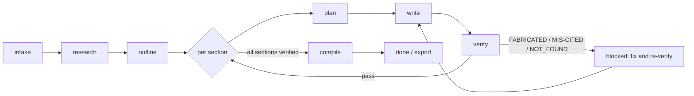

<p align="center">
  
</p>

<p align="center">
  <strong>Turn an assignment prompt into a fully-sourced draft — where every citation is re-fetched and checked against its live source before a single section can ship.</strong>
</p>

<p align="center">
  <a href="https://github.com/ZeusCraft10/pensmith/actions/workflows/ci.yml"></a>
  <a href="LICENSE"></a>
  =22.12">
  
  
</p>

<p align="center">
  <a href="#why-pensmith">Why</a> ·
  <a href="#how-it-works">How it works</a> ·
  <a href="#the-citation-verifier">The verifier</a> ·
  <a href="#install">Install</a> ·
  <a href="#quick-start">Quick start</a> ·
  <a href="#command-reference">Commands</a> ·
  <a href="#configuration">Configuration</a>
</p>

---

Pensmith guides you through a complete paper-writing workflow — **intake → research → outline → (plan → write → verify, per section) → compile → done** — drawing only on verifiable, peer-reviewed, and configurable academic sources. It ships as **two tiers that share the same workflow files**: a [Claude Code](https://claude.com/claude-code) plugin (Tier 1, which generates through your Claude session) and a portable Node.js CLI (Tier 2, which talks to a provider of your choice).

The thing that makes Pensmith different from "ask an AI to write my paper": **a section physically cannot leave the pipeline with a fabricated, mis-attributed, or unverifiable citation.** That gate is deterministic, runs per section, and blocks compile and export.

## Why Pensmith

- 📚 **Citations verified against the live source — not just generated.** Every cited DOI is re-fetched and the author/title are fuzzy-matched against what actually published. Fabricated DOIs, mismatched attributions, and quotes that don't appear in the source are flagged and **block the section**. See [The citation verifier](#the-citation-verifier).
- 🧩 **A paper is a project; a section is a phase.** Each section gets its own isolated `.paper/sections/<N>/` workspace (plan, draft, verification). Re-doing section 3 never touches sections 1, 2, 4, or 5 — state isolation is enforced by directory structure, not careful prompting.
- 🔎 **Real research, real sources.** Discovery fans out across OpenAlex, Crossref, arXiv, PubMed, and Unpaywall, then deduplicates and ranks candidates into a sourced research map. Section writers only ever see their own mapped sources.
- 🎯 **One command.** `/pensmith` reads your paper's state and dispatches the next step. Everything else is a power-user fallback.
- 🪪 **Honest by design.** No metadata or fingerprint is stamped into exported documents. The AI-likelihood transparency check reports a score for your own awareness — it never promises your writing will get past a detector. [Style Match](#style-match) is opt-in and openly dual-use.
- 🔒 **Safe by default.** Every outbound request — sources, verification, detectors and your model provider — leaves through one audited HTTP gate that validates and pins the destination address, caps response size, and logs what was sent; optional PII redaction (`pensmith new --pii-redact`, or `[project] pii_redaction = true`) scrubs your assignment text before any model call. Pensmith is **live by default** (it verifies against the real registrars); offline replay and `--dry-run` are explicit and always announced. API keys are never logged.
- 📄 **Compile & export.** Verified sections assemble into a single document and export to **DOCX / PDF / LaTeX / Markdown**, with citation rendering in 8 styles.

## How it works


```mermaid
flowchart LR
    A[intake] --> B[research]
    B --> C[outline]
    C --> D{per section}
    D --> P[plan]
    P --> W[write]
    W --> V[verify]
    V -->|pass| D
    V -->|"FABRICATED / MIS-CITED / NOT_FOUND"| X[blocked: fix and re-verify]
    X --> W
    D -->|all sections verified| E[compile]
    E --> F[done / export]
```

Approval gates sit at **outline** (you approve the structure before drafting) and **export** (you confirm before a document is written). Both default on; only `--yolo` skips them.

## The citation verifier

This is the load-bearing feature. After a section is drafted, a three-pass verifier runs **bounded to that section**:

| Pass | What it checks | Verdict | Blocking? |
|------|----------------|---------|-----------|
| **Pass 1 — integrity** | Re-fetches each cited DOI from the live source; fuzzy-matches author **and** title (DOI resolving is necessary but not sufficient) | `FABRICATED` / `MIS-CITED` | ✅ blocks |
| **Pass 3 — quote** | Confirms every quoted span exists verbatim in the cited source | `NOT_FOUND` | ✅ blocks |
| **Pass 2 / Pass 4 — judgment** | LLM-assisted claim-support and coherence review | advisory notes | ⚠️ never auto-blocks |

A section carrying a blocking verdict cannot be compiled or exported. The deterministic passes (1 and 3) are the gate; the advisory passes (2 and 4) surface things a human should look at without ever silently failing the build. Edits made after verification are detected via a draft-hash check, so a stale "verified" stamp can't sneak through.

## Install

> **Pre-release.** Pensmith is `v0.1.0-dev`. It is **not yet on npm** and the plugin marketplace listing isn't published — so install from source for now. Published npm + Claude plugin distribution is on the roadmap.

```bash
git clone https://github.com/ZeusCraft10/pensmith.git
cd pensmith
npm install
npm run build
```

Requires **Node.js ≥ 22.12.0** (the Node 22 and 24 LTS lines are tested on Linux, macOS and Windows).

**Tier 1 — Claude Code plugin (recommended)**

From a Claude Code session, register your local checkout as a plugin marketplace and install it:

```text
/plugin marketplace add ./pensmith        # path to your clone
/plugin install pensmith@pensmith
```

`/pensmith` is then available in any session, and generation runs through your existing Claude subscription — no separate API key required.

**Tier 2 — portable Node CLI**

```bash
npm link            # exposes `pensmith` on your PATH (from the clone)
pensmith --version
pensmith doctor     # environment self-check: Node, pandoc, MCP build, provider and keys, network mode
```

The CLI needs a model provider — an API key, or a local OpenAI-compatible server such as Ollama or vLLM (see [Configuration](#configuration)).

## Quick start

```text
/pensmith
```

That is the only command you need. Pensmith reads your paper's current state and dispatches the next step automatically — the first run starts intake; each subsequent run advances the workflow.

### What it looks like

```text
$ /pensmith
Pensmith ▸ no paper in this workspace yet — starting intake.
  ? Paste your assignment prompt (or path to it): …
  ✓ Discipline detected: computer science  ·  target length: ~3000 words
  ✓ Saved INTAKE.md

$ /pensmith
Pensmith ▸ research
  ⠿ Querying OpenAlex, Crossref, arXiv, PubMed, Unpaywall…
  ✓ 24 candidates → deduplicated → ranked  ·  CITATIONS.bib written

$ /pensmith
Pensmith ▸ verify §2  (Background)
  ✓ Pass 1  smith2021      DOI resolved · author+title matched
  ✗ Pass 1  vaswani2017    FABRICATED — DOI did not resolve
  ⚠ Pass 2  one claim under-supported by its cited source
  → §2 blocked: fix the flagged citation and re-run.
```

*Illustrative transcript; exact output and verdicts depend on your paper.*

## Command reference

In normal use, bare `/pensmith` handles dispatch. The 16 verbs below let power users jump straight to any stage.

| Verb | What it does |
|------|-------------|
| `doctor` | Environment self-check (Node version, MCP build, pandoc, humanizer skill, provider and key presence, network mode, …). Exits 1 on FAIL. |
| `new` | Start a new paper — capture the assignment (`--from <file>`), run the clarifying questions, detect the discipline, write `.paper/INTAKE.md`. |
| `next` | Run the next workflow step for the current paper (what bare `/pensmith` does). |
| `status` | The paper's position, per-section progress, cost so far and the next action. `--config` prints every effective setting and where it came from. |
| `research` | Discover sources across OpenAlex, Crossref, arXiv, PubMed, Semantic Scholar and Unpaywall, cross-check retractions, and merge the kept sources into `.paper/LIBRARY.json` (which renders `CITATIONS.bib` / `CITATIONS.ris`). |
| `outline` | Propose the section outline from the research. Approval gate (skippable with `--yolo`). |
| `plan` | Write one section's `PLAN.md` (`plan <n>`); `--revise` repairs a verifier-flagged citation. |
| `write` | Draft one section from only its mapped sources (`write <n>`), or every section in dependency waves (`write`). |
| `verify` | Run the blocking verifier on one section: DOI/arXiv/PMID re-fetch with author/title match, and quote exact-match. |
| `compile` | Assemble all verified sections into `.paper/DRAFT.md` + `COMPILE-REPORT.md` (refuses on any blocking verdict). |
| `done` | Finalize: re-check the gate, optional humanize, plagiarism and AI-likelihood transparency checks, then export (DOCX / PDF / LaTeX / Markdown) with no metadata trace. Export confirmation gate (skippable with `--yolo`). |
| `resume` | Summarize the last handoff and continue with the next step; `--replay <id>` re-runs a logged step. |
| `list` | List every paper Pensmith knows about, grouped by class, with its live status. |
| `open` | Make a paper the active one by name (as shown by `list`). |
| `sketch` | Thinking-partner thesis discovery before intake — asks a few questions; nothing is created until you confirm. |
| `add` | Add one source mid-paper (DOI, local PDF or URL): verify it, merge it into the library (a known work is reported as `already in library as <key>`), and optionally map it onto sections. |

## Configuration

### Network modes

Pensmith is **live by default**: research, `add`, the Pass 1 / Pass 3 re-fetch, retraction and freshness checks, the plagiarism check and the GPTZero check talk to the real services, with no environment variable needed. Two explicit modes change that, and both are always announced on stderr before anything else runs:

| Mode | How | What happens |
|------|-----|--------------|
| **Offline** | `PENSMITH_OFFLINE=1` | Sources, verification, detector and plagiarism requests replay **exactly recorded** fixtures from a source checkout, or fail closed as "unavailable (offline)". A citation that cannot be re-checked is `UNVERIFIABLE` and **blocks** compile and done until you re-run online. The banner reads `OFFLINE MODE (reason: PENSMITH_OFFLINE=1): …`, and RESEARCH.md, VERIFICATION.md and COMPILE-REPORT.md carry an offline marker line (never an export). The installed npm package ships no fixtures, so there it refuses instead — except `pensmith resume --replay <id>`, which replays a logged model response and needs no fixture. Only a model endpoint you configured on this machine (loopback) is still reachable. |
| **Dry run** | `--dry-run` | Nothing leaves the machine — zero sockets. Sources come from a clearly labelled synthetic provider (`10.0000/pensmith-dryrun.*`), and every model call returns a deterministic stub. Synthetic identifiers are refused everywhere outside `--dry-run`. |

`PENSMITH_NO_LLM=1` is independent of the network mode: it replaces every LLM call with a deterministic stub (testing and dry-run) and prints `LLM STUBBED …`. `pensmith doctor` shows `network: live` or `network: OFFLINE (<reason>)`. The test suite (`npm test`) always runs sources offline unless a maintainer sets `PENSMITH_NETWORK_TESTS=1`.

### Model runtimes

With `ANTHROPIC_API_KEY` set, Pensmith uses Anthropic with `claude-opus-5` for generation (outline, planning, drafting, smoothing) and `claude-haiku-4-5` for the high-volume judgment steps (source evaluation, query generation, the advisory verifier passes). With only `OPENAI_API_KEY` set, it selects OpenAI and its default generation and judgment models automatically. `pensmith status --config` shows the model each step will use and where that choice came from.

- `--runtime <provider>` picks `anthropic`, `openai`, `ollama`, `vllm` or `openai-compatible`; `--model <id>` overrides the generation model (judgment steps keep theirs). Unknown providers are rejected with the list of valid ones.
- **Local models.** `ollama` (default endpoint `http://127.0.0.1:11434/v1`), `vllm` (`http://127.0.0.1:8000/v1`) and any `openai-compatible` server are called through the chat-completions API; no key is needed, and there is no default model — set `[runtime] model` or pass `--model`.
- **Where each setting lives.** The endpoint and the key variable (`endpoint`, `api_key_env`) are set **only** in the global `runtime.json` in your Pensmith data directory (`%LOCALAPPDATA%\pensmith\` on Windows, `~/Library/Application Support/pensmith/` on macOS, `$XDG_DATA_HOME/pensmith/` or `~/.local/share/pensmith/` elsewhere), for example `{"$schemaVersion": 2, "provider": "openai-compatible", "endpoint": "http://127.0.0.1:1234/v1", "model": "qwen2.5"}`. A paper's `.paper/config.toml` may choose `provider`, `model`, `effort`, `price_in_per_mtok` / `price_out_per_mtok` and per-step `[runtime.slugs.<step>]` models, but never an endpoint or key — a paper folder you synced or cloned cannot redirect your prompts or keys. `api_key_env` must name a provider key or a `*_API_KEY` variable; a plain-`http://` endpoint must be on this machine, and link-local / cloud-metadata addresses are always refused.
- **Precedence:** `--runtime` / `--model` → `.paper/config.toml` `[runtime]` → global `runtime.json` → the key found in your environment → the default.

### Cost cap and estimates

Each run of `pensmith` (one invocation, including the steps a bare `pensmith` chains) has a **cost cap**: `[budget] cost_cap_usd` in `.paper/config.toml`, default **$5.00**, or `PENSMITH_COST_CAP_USD`. Before every model call Pensmith projects the call's cost; if it would cross the cap, you are asked in a terminal, and a non-interactive run — `--yolo` included — sends nothing and exits with code 5. `[budget] warn_at_usd` prints one warning when the running total passes it. `--estimate` projects the remaining pipeline step by step (model, price, total) without any network or model call, then asks `Proceed? [y/N]` in a terminal.

### Which paper

Pensmith works on the `.paper/` folder in the current directory. `--paper <name|path>` (or `PENSMITH_PAPER_ROOT`) picks another; `pensmith open <name>` sets an active paper that read-only commands (`status`, `list`, `doctor`, `--estimate`) follow with a banner. A command that would change a paper asks before following that pointer — and outside a terminal, or with `--yolo`, it refuses (exit 2) and names `--paper <name>` or `pensmith new` instead. In a folder with no paper and no pointer, only `pensmith` / `next` / `resume` (which start one with `new`), `new`, `sketch` and the read-only commands run; any other command exits 2 (`no paper in <folder> — run pensmith new …`) and creates nothing.

### What was sent: SESSION.log and --show-prompts

Every model call is recorded in `.paper/SESSION.log` (JSONL): the step, provider, model, the prompt as sent, the response, tokens and cost (matching the cost ledger); every source request is recorded with its URL (secrets removed), status and cache use. API keys never appear. `[logging] session_bodies = "redacted"` keeps only hashes, counts, cost and short previews. `PENSMITH_OFFLINE=1 pensmith resume --replay <id>` re-runs a logged step from the logged response (no model call, $0; the `--runtime` / `--model` it was run with are re-applied) — in a source checkout or the installed package. `--show-prompts` prints each outgoing request to stderr **before** it is sent: the full model request, every source URL, the GPTZero payload preview and the DuckDuckGo queries — with keys, cookies and authorization headers removed.

### Flags

`--dry-run`, `--estimate`, `--yolo` (skip the gates `--yolo` may skip: outline approval, export confirmation, research scope and pruning, the `add` remap, the revise swap and the `sketch` confirmation — never the cost cap, the estimate confirmation, detector consent or the active-paper choice), `--show-prompts`, `--runtime <provider>`, `--model <id>`, `--paper <name|path>`. `pensmith --help` lists them with the exit codes.

### Exit codes

| Code | Meaning |
|------|---------|
| `0` | Success |
| `1` | Error — provider failure or refusal, invalid configuration, internal error |
| `2` | Usage — unknown command or flag, invalid arguments, missing required input |
| `3` | Approval — a gate needs an answer and there is no terminal and no `--yolo`, or you declined |
| `4` | Blocked — the verifier or a gate refused (verify failed, compile REFUSED, done BLOCKED, stale output) |
| `5` | Cost cap — the next model call would exceed the session cost cap |

Expected failures print one line (`pensmith: …`); `PENSMITH_DEBUG=1` adds a stack trace for unexpected errors.

### Environment variables

| Variable | Purpose |
|----------|---------|
| `ANTHROPIC_API_KEY` / `OPENAI_API_KEY` | Provider key for the **Tier 2 CLI**. With only `OPENAI_API_KEY` set, OpenAI is selected automatically. Local runtimes need neither. |
| `PENSMITH_OFFLINE=1` | Sources offline: exact recorded fixtures or fail closed (see [Network modes](#network-modes)). |
| `PENSMITH_NO_LLM=1` | Replaces every LLM call with a deterministic stub (testing and dry-run). |
| `PENSMITH_COST_CAP_USD` | Per-session cost cap in USD (overrides `[budget] cost_cap_usd`, default 5.00). |
| `PENSMITH_CONTACT_EMAIL` | Polite-pool contact sent to Crossref / OpenAlex / Unpaywall so your queries are well-behaved. |
| `OPENALEX_API_KEY` | *Optional.* OpenAlex API key (higher rate limits). |
| `PENSMITH_S2_API_KEY` | *Optional.* Semantic Scholar API key. |
| `GPTZERO_API_KEY` | *Optional.* Enables the AI-likelihood transparency check; it still asks for your consent before sending text (`--yolo` never grants it). |
| `ZOTERO_API_KEY` | *Optional.* Enables the Zotero library adapter. |
| `PENSMITH_PAPER_ROOT` | The project folder (the one containing `.paper/`) for the CLI, the MCP server and the hooks. |
| `PENSMITH_PROMPT_MODE=numbered` | Answer prompts from piped stdin, one line per question (scripts and CI). |
| `PENSMITH_DEBUG=1` | Print a stack trace for unexpected errors. |
| `PENSMITH_NETWORK_TESTS=1` | *Maintainers.* Lets the test suite reach the live services (the live test lane). |

## Style Match

Style Match is an **opt-in** feature. Point Pensmith at a folder of your own past writing (`--style-samples <dir>`) and it builds a private, per-paper statistical profile of how you write — typical sentence length, vocabulary density, paragraph shape, common sentence openers — and uses it to help new sections **match your own established voice**.

It is dual-use, and we are direct about that:

- It **improves prose so it reads like your own past writing.** The profile is built from plain statistics — no external model, no network call — and stays inside your paper as `.paper/STYLE.json`.
- It **does not claim to make AI authorship invisible to detectors.** The separate AI-likelihood check reports a score as transparency; Style Match neither changes what that score means nor promises any particular result.
- It is intended for **matching your own voice** — not for passing off someone else's work as your own. The samples you provide should be your own writing.

To keep this honest at the tool level, Pensmith surfaces a transparency notice whenever the same writing samples were already used to style a different paper. That notice always prints; no flag can silence it.

## Architecture

Two tiers, one source of truth:

- **Tier 1 — Claude Code plugin.** Skills + an MCP server. Generates through your Claude session and uses `Task` subagents for the heavy stages.
- **Tier 2 — portable Node CLI.** The same workflow bodies, runnable anywhere Node is. Workflow bodies use `<capability_check>` blocks to degrade gracefully when `Task` / MCP / interactive prompts aren't available.

A drift gate (`tests/tier-contract.test.ts`) keeps the two tiers behaving identically. Every section lives under its own `.paper/sections/<N>/` directory (`PLAN.md`, `DRAFT.md`, `VERIFICATION.md`), which is what makes per-section isolation and bounded re-verification possible.

## Privacy & security

- **PII redaction is opt-in**: with `pensmith new --pii-redact` (or `[project] pii_redaction = true` in `.paper/config.toml`) the assignment text is redacted, recursively across structured payloads, before any model call. It is off by default.
- **All outbound network goes through one audited gate** (`bin/lib/http.ts`): every destination is DNS-resolved and validated, the connection is pinned to the validated address, private / loopback / link-local ranges are refused (only the local model endpoint you configure is allowed), responses are size-capped, and each request is logged without secrets.
- **Zero export trace** — no metadata stamp, footer, or fingerprint is written into your exported documents. The disclaimer below is the sole disclosure mechanism.
- **Secrets are never logged** — only their presence, never their value.

See [`PRIVACY.md`](PRIVACY.md) and the project's security notes for the full threat model.

## Project status

Pensmith is **alpha** (`v0.1.0-dev`), working toward the v1.0.0 open-source release. The two-tier architecture, the verifier gate, the research pipeline, compile/export, and the single-command UX are implemented and covered by a CI matrix of Node 22 and 24 on Ubuntu, macOS and Windows. The Tier 2 CLI is the complete path today; key-free generation through your Claude session for every Tier 1 stage, published distribution (npm + plugin marketplace) and a fully source-fed planner/writer are on the roadmap.

## Contributing

Contributions are welcome. Start with [`CONTRIBUTING.md`](CONTRIBUTING.md) for setup and conventions, and [`README-DEV.md`](README-DEV.md) for the developer-facing tour. Run the full gate before opening a PR:

```bash
npm run check    # prebuild · lint · typecheck · build · tests · manifest validation
```

## Credits

Pensmith is heavily inspired by [Get Shit Done](https://github.com/gsd-build/get-shit-done) by TÂCHES (Lex Christopherson) and the [gsd-plugin](https://github.com/jnuyens/gsd-plugin) repackaging by Jasper Nuyens. The skill / agent / MCP / workflow-body / `HANDOFF.json` patterns are theirs, and the **section-as-phase** mental model is a direct application of GSD's structured-workflow philosophy to academic writing. The domain (academic writing instead of code), the command UX (single-command vs. per-stage), and the implementation are independent.

## Disclaimer

Pensmith is a structured research-and-drafting assistant for academic writing. It helps you turn an assignment prompt into a sourced outline or, optionally, a full draft, using only verifiable peer-reviewed and configurable academic sources. It includes a citation verifier that re-fetches every cited DOI and flags unsupported claims for human review, and a humanizer pass that improves readability.

This tool is for your own writing, research, and learning. **It is not a guarantee against AI detectors, and it is not a substitute for doing the reading.** Submitting fully tool-generated work as your own is, in many institutions, a violation of academic-integrity policy. You are responsible for the work you submit.

## License

[AGPL-3.0-or-later](LICENSE) © Akhil Achanta
