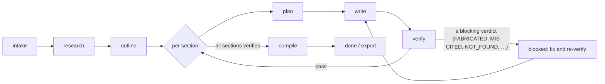

<p align="center">
  
</p>

<p align="center">
  <strong>Turn an assignment prompt into a fully-sourced draft — where every citation is re-fetched and checked against its live source before a single section can ship.</strong>
</p>

<p align="center">
  <a href="https://github.com/ZeusCraft10/pensmith/actions/workflows/ci.yml"></a>
  <a href="LICENSE"></a>
  =22.12">
  
  
</p>

<p align="center">
  <a href="#why-pensmith">Why</a> ·
  <a href="#how-it-works">How it works</a> ·
  <a href="#the-citation-verifier">The verifier</a> ·
  <a href="#install">Install</a> ·
  <a href="#quick-start">Quick start</a> ·
  <a href="#command-reference">Commands</a> ·
  <a href="#configuration">Configuration</a>
</p>

---

Pensmith guides you through a complete paper-writing workflow — **intake → research → outline → (plan → write → verify, per section) → compile → done** — drawing only on verifiable, peer-reviewed, and configurable academic sources. It ships as **two tiers that share the same workflow bodies, prompts and presets** (the [`plugin/`](plugin/) directory): a [Claude Code](https://claude.com/claude-code) plugin (Tier 1) and a portable Node.js CLI (Tier 2). Both call a model provider of your choice; [Install](#install) says what the plugin runs itself in this release.

The thing that makes Pensmith different from "ask an AI to write my paper": **a section physically cannot leave the pipeline with a fabricated, mis-attributed, or unverifiable citation.** That gate is deterministic, runs per section, and blocks compile and export.

## Why Pensmith

- 📚 **Citations verified against the live source — not just generated.** Every cited DOI is re-fetched and the author/title are fuzzy-matched against what actually published. Fabricated DOIs, mismatched attributions, and quotes that don't appear in the source are flagged and **block the section**. See [The citation verifier](#the-citation-verifier).
- 🧩 **A paper is a project; a section is a phase.** Each section gets its own isolated `.paper/sections/<N>/` workspace (plan, draft, verification). Re-doing section 3 never touches sections 1, 2, 4, or 5 — state isolation is enforced by directory structure, not careful prompting.
- 🔎 **Real research, real sources.** Discovery fans out across OpenAlex, Crossref, arXiv, PubMed, and Unpaywall, then deduplicates and ranks candidates into a sourced research map. Section writers only ever see their own mapped sources.
- 🎯 **One command.** `/pensmith` reads your paper's state and takes the next step — for a section, it plans, drafts and verifies it in one go. Everything else is a power-user fallback.
- 🪪 **Honest by design.** No metadata or fingerprint is stamped into exported documents. The AI-likelihood transparency check reports a score for your own awareness — it never promises your writing will get past a detector. [Style Match](#style-match) is opt-in and openly dual-use.
- 🔒 **Safe by default.** Every outbound request — sources, verification, detectors and your model provider — leaves through one audited HTTP gate that validates and pins the destination address, caps response size, and logs what was sent; optional PII redaction (`pensmith new --pii-redact`, or `[project] pii_redaction = true`) scrubs your assignment text before any model call. Pensmith is **live by default** (it verifies against the real registrars); offline replay and `--dry-run` are explicit and always announced. API keys are never logged.
- 📄 **Compile & export.** Verified sections assemble into a single document and export to **DOCX / PDF / LaTeX / Markdown**, with citation rendering in 8 styles.

## How it works


```mermaid
flowchart LR
    A[intake] --> B[research]
    B --> C[outline]
    C --> D{per section}
    D --> P[plan]
    P --> W[write]
    W --> V[verify]
    V -->|pass| D
    V -->|"a blocking verdict (FABRICATED, MIS-CITED, NOT_FOUND, …)"| X[blocked: fix and re-verify]
    X --> W
    D -->|all sections verified| E[compile]
    E --> F[done / export]
```

Approval gates sit at **outline** (you approve the structure before drafting) and **export** (you confirm before a document is written). Both default on; only `--yolo` skips them.

## The citation verifier

This is the load-bearing feature. After a section is drafted, a three-pass verifier runs **bounded to that section**:

| Pass | What it checks | Verdict | Blocking? |
|------|----------------|---------|-----------|
| **Pass 1 — integrity** | Re-fetches every cited identifier — and every DOI, arXiv id or PMID written in the prose — at the registrar that holds it (a DOI at Crossref, else at the agency doi.org names: DataCite for Zenodo / figshare / Dryad, content negotiation for mEDRA / JaLC / KISTI; an arXiv id at arXiv, a PMID at PubMed, an ISBN at the book registries; an entry with no identifier by a strict metadata search), then matches first author, title and year (DOI resolving is necessary but not sufficient); checks each citation is one of the section's assigned sources and that every attribution is a Pandoc citation it can check | `OK` / `OK-BYO` pass; `FABRICATED` / `MIS-CITED` / `RETRACTED` / `UNASSIGNED` / `UNRESOLVABLE` / `UNPARSEABLE` (a citation that does not parse, or a key the bibliography defines twice) / `UNSUPPORTED-FORM` (author-date prose, a footnote, a typed reference list, `\cite{}`, `<cite>`, a numbered marker, a YAML metadata block, raw `{=format}` output) fail; `UNVERIFIABLE-NETWORK` when the registrar gave no answer (re-run online), `UNVERIFIABLE` when its answer cannot be compared | ✅ blocks |
| **Pass 3 — quote** | Finds every direct quote (at least `[verification] quote_min_words` words, default 5) and checks it against the cited source's real text: your own PDF first, else an open-access copy (every PDF Unpaywall lists, the Europe PMC full text, the arXiv PDF) | `PASS` / `FUZZY` pass; `NOT_FOUND` and `UNATTRIBUTED` (a quote with no citation) fail; `UNVERIFIABLE-QUOTE` when no copy of the source's text can be checked, `UNVERIFIABLE-NETWORK` when none answered | ✅ blocks |
| **Draft checks** | A section with assigned sources that cites none; stub text written with no model configured | `NO-CITATIONS` / `PLACEHOLDER` | ✅ blocks |
| **Pass 2 / Pass 4 — judgment** | Claim support judged on the source's text (its abstract plus the open-access passage nearest the claim), with the evidence quoted; orphan claims (a deterministic floor plus an LLM audit per paragraph that can only add) | advisory notes | ⚠️ never auto-blocks |

A section carrying a blocking verdict cannot be compiled or exported. The deterministic passes (1 and 3) are the gate; the advisory passes (2 and 4) surface things a human should look at without ever silently failing the build. Each section's `VERIFICATION.md` opens with a summary table of its verdicts.

`compile` and `done` trust no file on disk: they re-run the same deterministic gate over the exact text they assemble or export, so a hand-edited `VERIFICATION.md`, a draft changed after verification, or a citation typed into the compiled `.paper/DRAFT.md` is caught and named — the fix belongs in the section drafts. A section that could not be verified (a source unreachable offline, a quote with no checkable source text, stub text) does not hold up the other sections; compile refuses it and names the options. For a quote no source text can confirm, those are: add the source's PDF (`pensmith add <pdf>`), paraphrase, or accept that one quote yourself with `pensmith verify <n> --accept-quote q2` — recorded with its time, void as soon as the draft changes, and listed in the compile report and at export. `done` asks you to decide on every claim the advisory check judged unsupported (`--yolo` records them as auto-accepted) and records the decisions in `.paper/VERIFICATION.md`. A source is re-checked at its registrar, not from the local cache, once its last check is older than `[verification] recheck_after_days` (30 by default); `.paper/CITATIONS.bib` records each source's `last_verified`, and the exported bibliography never carries it. A retracted source is a blocking `RETRACTED` verdict (also printed as a warning); for a DOI whose agency publishes no retraction data the row says "retraction status unknown" — reported, never shown as clean.

## Install

> **Pre-release.** Pensmith is `v0.1.0-dev` and **not yet on npm**. The Claude Code plugin installs straight from this Git repository; the CLI installs from a clone.

Requires **Node.js ≥ 22.12.0** on your `PATH` (the Node 22 and 24 LTS lines are tested on Linux, macOS and Windows) — for the CLI, and for the plugin, whose MCP server and hooks run with `node`.

**Tier 1 — Claude Code plugin**

In a Claude Code session, add this repository as a plugin marketplace and install the plugin:

```text
/plugin marketplace add ZeusCraft10/pensmith
/plugin install pensmith@pensmith
```

(From a terminal: `claude plugin marketplace add ZeusCraft10/pensmith`, then `claude plugin install pensmith@pensmith`. A local clone works too: `/plugin marketplace add ./pensmith`.) There is no `npm install` and no build step: the plugin is the repository's [`plugin/`](plugin/) directory, and its MCP server and hooks are committed, self-contained bundles. After installing, `/mcp` should list the `pensmith` server as connected; if it does not, check that `node --version` reports 22 or newer in the environment Claude Code starts from, then restart Claude Code. To update later, run `claude plugin marketplace update pensmith` and then `claude plugin update pensmith@pensmith` from a terminal, and restart Claude Code: every change to the plugin carries a new version, so an update always installs the latest commit.

`/pensmith` and plain requests ("where am I?", "check the citations in section 3") then work in any session. In this release the plugin runs `status`, `plan`, `write` and `verify` through its own MCP server: `status` and `verify` need no API key, while `plan` and `write` call the model provider configured for pensmith (see [Model runtimes](#model-runtimes)), exactly as the CLI does. The other stages — intake, research, outline, compile and done — run through the Tier 2 CLI, which `/pensmith` calls for you when `pensmith` is on your `PATH`. Generating through your Claude session with no API key is on the roadmap, not in this release.

**Tier 2 — portable Node CLI**

```bash
git clone https://github.com/ZeusCraft10/pensmith.git
cd pensmith
npm install
npm run build
npm link            # exposes `pensmith` on your PATH (from the clone)
pensmith --version
pensmith doctor     # environment self-check: Node, pandoc, the plugin's MCP server bundle, provider and keys, network mode
```

The CLI needs a model provider — an API key, or a local OpenAI-compatible server such as Ollama or vLLM (see [Configuration](#configuration)).

## Quick start

Put your assignment in a folder — `assignment.txt`, `assignment.md` or `assignment.pdf` — and run:

```text
/pensmith
```

That is the only command you need (`pensmith` in a terminal is the same command). Pensmith reads your paper's current state and takes **one step** each time you run it: intake, research, the outline (which you approve), then each section — planned, drafted and verified in one go — then compile and export. Every run ends by saying what it did and what comes next.

### What it looks like

```text
$ ls
assignment.txt
$ pensmith
  ? Which discipline is this paper for?  › Computer science
  ? Citation style?  › APA
  …
pensmith new: wrote INTAKE.md to .paper/INTAKE.md
pensmith: ran new; next: research
$ pensmith
pensmith research: wrote LIBRARY.json (6 source(s); 6 new) …
pensmith: ran research; next: outline
$ pensmith
  (the proposed outline)  ? Approve this outline? › yes
pensmith outline: registered 3 section(s) in STATE.json.
pensmith: ran outline; next: plan §1
$ pensmith
pensmith plan: wrote PLAN.md to .paper/sections/01-introduction/PLAN.md
pensmith write: wrote DRAFT.md to .paper/sections/01-introduction/DRAFT.md
pensmith write: section 1 verify: verified
pensmith: ran plan §1, write §1; next: plan §2
…
$ pensmith
pensmith done: exported .paper/export/DRAFT.docx
pensmith: ran done; next: status (done)
```

*Illustrative transcript (paths shortened); the questions, sources and verdicts depend on your assignment.* A section whose citation fails verification stops the run with exit code 4 and says which citation and why; fix it and run `pensmith` again. `pensmith --yolo` answers the approval gates for you (never the cost cap), and `pensmith --dry-run --yolo` rehearses the whole paper for free in `./.paper-dry-run/` — see [Network modes](#network-modes).

### Starting a paper

`pensmith new` (or the first bare run) takes the assignment from, in order: `--from <file>` or `new @<file>` (`.txt`, `.md` or `.pdf`), a pipe (`pensmith new < prompt.txt`), an `assignment.*` file in the folder, or — in a terminal — a paste. It then asks the intake questions — discipline, whether you want the full draft or only an outline (outline only ends in a checked outline and an annotated bibliography — see [Exports](#exports) — and no section is planned or drafted until you set `mode = "draft"` in `.paper/config.toml` or run a section yourself), what the paper is for, the class it belongs to, whether a counterargument section is required, style matching, PII redaction, target length and citation style — offering the model's suggestion from your assignment as each default. Answer any of them up front with flags of `pensmith new` (`--discipline`, `--mode draft|outline`, `--goal`, `--class "PHIL 101"`, `--counterargument yes|no|auto`, `--style-samples <dir>`, `--pii-redact`, `--length 1500`, `--citation-style MLA`) or all of them with `pensmith new --answers <file.toml>`, then continue with bare `pensmith`. A bare `pensmith` takes only the global flags (`--yolo`, `--dry-run`, …), so it refuses an intake flag and points you to `pensmith new`:

```toml
# answers.toml — keys are the question ids (`pensmith new --questions` lists them)
discipline = "history"
mode = "draft"
class = "HIST 210"
counterargument = "yes"
length = 2500
citation_style = "Chicago"
```

Plain-English instructions in the assignment are honoured ("Use MLA for this paper", "I need a literature review section before methods"). Without a terminal and without `--yolo`, an unanswered question stops intake (exit 3) before anything is sent or written; `--yolo` accepts the suggestions and prints them. The answers become `.paper/INTAKE.md`, the brief every later step reads.

### Exports

`pensmith done --format md|docx|pdf|latex` always writes the format you ask for into `.paper/export/`. Markdown is always written by Pensmith itself; Word, PDF and LaTeX use [pandoc](https://pandoc.org) when it is installed (a PDF also needs a TeX engine: pdflatex, xelatex, lualatex or tectonic), and otherwise Pensmith's own writer of that format — a real `.docx`, a real PDF set in the bundled Liberation Serif (SIL Open Font License), or a standalone LaTeX file that compiles with pdfLaTeX or XeTeX. The run says which writer made the file. Citations are rendered in your paper's style — APA, MLA, Chicago (author-date and notes), IEEE, Harvard, Vancouver or AMA, or any `.csl` file — on both paths, with page locators, footnotes for a note style and numbering for a numeric one, and titles keep their capitals (China stays China). Next to the document, `export/CITATIONS.bib` and `export/CITATIONS.ris` hold only the sources the document cites. Every exported file is scrubbed and then scanned for any trace — a Pensmith name, an author or producer field, a generator comment, a local path, embedded metadata; a file that fails is deleted and the export refused, never shipped.

**Outline only.** If you chose an outline instead of a full draft, Pensmith researches, outlines (you approve it) and then, at `done`, re-checks every source the outline lists at its registrar — a fabricated or retracted source blocks the export (exit 4) — and writes `.paper/ANNOTATED-BIBLIOGRAPHY.md`: each source's reference in your style, its type, a short excerpt of its abstract, why it is relevant and the sections it supports. It exports `OUTLINE` and `ANNOTATED-BIBLIOGRAPHY` (Markdown from a bare `pensmith`; `pensmith done --format docx` adds Word copies), and `pensmith status` then lists them. No section is planned or drafted, and no model is called at `done`.

## Command reference

In normal use, bare `/pensmith` handles dispatch. The 16 verbs below let power users jump straight to any stage; for scripts, Claude Code also has the plumbing commands `/pensmith:<stage>` ([`docs/PLUMBING.md`](docs/PLUMBING.md)).

| Verb | What it does |
|------|-------------|
| `doctor` | Environment self-check (Node version, the plugin's MCP server bundle, pandoc, humanizer skill, provider and key presence, network mode, …). Exits 1 on FAIL. |
| `new` | Start a new paper — take the assignment (`--from <file>`, `@<file>`, a pipe, `assignment.*` or a paste), ask the intake questions (flags or `--answers <file.toml>`), write the brief `.paper/INTAKE.md` (see [Starting a paper](#starting-a-paper)). |
| `next` | Take the next step of the current paper — what bare `/pensmith` does: one verb, or for a section its plan → write → verify. |
| `status` | The paper's position, per-section progress, cost so far and the next action. `--config` prints every effective setting and where it came from. |
| `research` | Build the source library from the paper's brief: pick a scope (`--scope <n\|text>`), run 5–10 queries (`--queries <n>`) against the discipline's preferred databases (OpenAlex, Crossref, arXiv, PubMed, Semantic Scholar, Open Library books, your Zotero), report every database's outcome, tier and filter by `[sources]`, let the source evaluator judge, ask which to keep (and take any DOI / URL you add), cross-check retractions, and write `.paper/LIBRARY.json` (which renders `CITATIONS.bib` / `CITATIONS.ris`) and a readable `.paper/RESEARCH.md`. Your own PDFs (`[sources] byo_pdf_dir`) and Zotero collection (`[sources] zotero_collection`) are added first. |
| `outline` | Propose the section outline from the research and your brief. Approval gate (skippable with `--yolo`). `--no-counter` drops the counterargument requirement; `--force` re-outlines a paper that has drafts — sections that keep their slug stay untouched. Sources the citation verifier cannot check (no DOI, arXiv id, PMID or ISBN) and sources flagged retracted are not offered to the outline or the planner; `outline` names them so you can `add` an identifier the verifier resolves (a retracted one is never cited). After you edit `.paper/OUTLINE.md` by hand, `pensmith outline` applies it without a model call (a section you removed moves to `sections/_archive/`). |
| `plan` | Write one section's `PLAN.md` (`plan <n>`); `--revise` repairs a verifier-flagged citation; `plan <n> --research "<query>"` runs a research pass for that section only and adds the hits to its sources. |
| `write` | Draft one section from only its assigned sources and verify it (`write <n>`), or every section in dependency waves (`write`, up to `--max-parallel` at a time, default 5). `--no-verify` leaves the drafts unverified. |
| `verify` | Run the blocking verifier on one section: each citation re-fetched by its DOI, arXiv id, PMID or ISBN at that identifier's own registrar, with author/title match, and quote exact-match. `--accept-quote q<n>` (repeatable) accepts a quote whose source text cannot be checked. |
| `compile` | Assemble all verified sections into `.paper/DRAFT.md` — the paper title, then each section under its own heading — and `COMPILE-REPORT.md` (refuses on any blocking verdict). It smooths each section boundary through the model without touching a citation or quote (`--no-smooth` keeps the verified text), flags claims that contradict each other across sections, and reports the citation density against your discipline's band. |
| `done` | Finalize: re-check the gate, a basic plagiarism check, the AI-likelihood transparency check, the humanizer, then export (DOCX / PDF / LaTeX / Markdown) with no metadata trace, and write `.paper/FINAL.md`. Export confirmation gate (skippable with `--yolo`). Flags: `--format`, `--style <name\|file.csl>`, `--raw`, `--no-verify`, `--no-score`, `--no-plagiarism-check`, `--only <step>` — see [Finishing a paper](#finishing-a-paper). `export`, `humanize`, `score` and `plagiarism` are aliases of `done --only <step>`, not verbs of their own. |
| `resume` | Summarize the last handoff and take the next step (the same step as `next`); `--replay <id>` re-runs a logged step. |
| `list` | List every paper Pensmith knows about, grouped by class, with its live status. |
| `open` | Make a paper the active one by name (as shown by `list`). |
| `sketch` | Thinking-partner thesis discovery before intake — asks a few questions; nothing is created until you confirm. |
| `add` | Add a source mid-paper — a DOI, arXiv id, `PMID:<id>`, `isbn:<ISBN>`, URL, local PDF or a folder of PDFs: identify the right work or refuse (a PDF is identified from its identifiers or its title and first author, never guessed), merge it into the library (a known work is reported as `already in library as <key>`), and offer to map it onto the relevant sections. `--pdf <file>` attaches your copy of the PDF to an identifier. |

### Finishing a paper

`pensmith done` (or bare `/pensmith` once the paper is compiled) runs, in order:

1. **The blocking gate** — every citation of the compiled draft is re-checked; nothing below runs if anything blocks.
2. **A basic plagiarism check** — the most distinctive phrases of each body paragraph (rare words ranked against the SCOWL word list) are searched as exact quotes on DuckDuckGo, and a result counts only when it holds the phrase word for word; matches are listed with their section and paragraph. It is a basic check, **not a substitute for your institution's plagiarism tools**. `--no-plagiarism-check` or `[verification] plagiarism_check = false` turns it off.
3. **The AI-likelihood transparency check** — before and after the humanizer, with the detector you configure (`[humanizer] honesty_backend`: `gptzero`, `originality` or `sapling`, with its API key). Each line is a real score with its detector and time (`61% AI-generated (gptzero, 2026-10-01T09:12:44Z)`) or the one reason there is none (`skipped (no GPTZERO_API_KEY set)`, `unavailable (offline)`, …). The first time, in a terminal, Pensmith asks whether it may send your paper to that service and saves your answer in `.paper/config.toml` (`honesty_consent`); `--yolo` never answers it, and without a terminal nothing is sent until you have said yes once. It is shown for your awareness only; nothing here promises any detector result. `--no-score` turns it off.
4. **The humanizer** — if you have a `humanizer` skill installed for Claude Code (`~/.claude/skills/humanizer/SKILL.md`), Pensmith sends each section to your model with that skill as its instructions, to improve readability. Every citation and quote is masked first and must come back unchanged, and the rewritten paper must pass the full citation gate again; if it does not, done stops (exit 4) and exports nothing — `pensmith done --raw` exports the compiled draft instead. Without the skill, done says so and skips it.
5. **The export decision** — the claims Pass 2 judged unsupported, uncited claims, plagiarism matches and contradictions compile flagged are listed; you confirm (or `--yolo`).
6. **The export** in the citation style you chose (`--style`, else `[project] citation_style`, else the brief's style, else your discipline's default; done prints which), then `.paper/FINAL.md` — exactly the text exported.

The steps are also available one at a time, each after the blocking gate: `pensmith score` and `pensmith plagiarism` print their result and write nothing, `pensmith humanize` writes `FINAL.md` without exporting, and `pensmith export` renders `FINAL.md` (or the compiled draft) after the export decision. They are aliases of `pensmith done --only score|plagiarism|humanize|export`.

## Configuration

### Network modes

Pensmith is **live by default**: research, `add`, the Pass 1 / Pass 3 re-fetch, retraction and freshness checks, the plagiarism check and the AI-detector check talk to the real services, with no environment variable needed. Two explicit modes change that, and both are always announced on stderr before anything else runs:

| Mode | How | What happens |
|------|-----|--------------|
| **Offline** | `PENSMITH_OFFLINE=1` | Source and verification requests replay **exactly recorded** fixtures from a source checkout, or fail closed as "unavailable (offline)"; the AI-detector score and the plagiarism check send nothing and say `unavailable (offline)` / `skipped (offline)` — never a replayed score. A citation or quote that cannot be re-checked is `UNVERIFIABLE-NETWORK` and **blocks** compile and done until you re-run online. The banner reads `OFFLINE MODE (reason: PENSMITH_OFFLINE=1): …`, and RESEARCH.md, VERIFICATION.md and COMPILE-REPORT.md carry an offline marker line (never an export). The installed npm package ships no fixtures, so there it refuses instead — except `pensmith resume --replay <id>`, which replays a logged model response and needs no fixture. Only a model endpoint you configured on this machine (loopback) is still reachable. |
| **Dry run** | `--dry-run` | Nothing leaves the machine — zero sockets. Sources come from a clearly labelled synthetic provider (`10.0000/pensmith-dryrun.*`), and every model call returns a deterministic stub that fits the step. A dry run works in its own folder, `./.paper-dry-run/`: in a folder with a paper it starts from a copy of `.paper/` (re-copied whenever the paper changes) and **never writes `.paper/`**, and it is never added to `pensmith list`. `pensmith --dry-run --yolo` next to an `assignment.txt` goes from intake to `.paper-dry-run/export/DRAFT.dry-run.docx` in one run; without `--yolo` it stops at the first question it needs you for. Its sources and verdicts are real only for the dry run — a real citation is reported UNVERIFIABLE-NETWORK (no request is sent) — and synthetic identifiers are refused everywhere outside `--dry-run`. Delete `.paper-dry-run/` at any time. |

`PENSMITH_NO_LLM=1` is independent of the network mode: it replaces every model call with a deterministic stub that satisfies the step's contract — structured steps return valid objects built from the request, and the drafter writes to the section's word target citing only the section's assigned sources — and prints `LLM STUBBED …`. Without any model configured, `pensmith verify` still records the blocking Pass 1 / Pass 3 verdicts; the advisory claim-support and orphan checks are reported as `skipped (no LLM configured)`. `pensmith doctor` shows `network: live` or `network: OFFLINE (<reason>)`. The test suite (`npm test`) always runs sources offline unless a maintainer sets `PENSMITH_NETWORK_TESTS=1`.

### Sources

Research, `add` and the verifier talk to free scholarly services: Crossref, DataCite, OpenAlex, arXiv, PubMed, Semantic Scholar, Unpaywall, Europe PMC (open-access full text for quote checks) and Open Library (Google Books as the ISBN fallback), plus doi.org to learn which agency registered a DOI, and your own Zotero library when you connect it. Each one is asked politely — at most its published rate (arXiv one request every three seconds, Crossref three a second, …), lower when the service says so, held back after a "slow down" (HTTP 429), and not at all for the rest of the run once it answers "come back in hours", fails three times in a row, or keeps refusing after pensmith has slowed down — and every failure is reported with its reason and the fix, never as "no results". [`docs/SOURCES.md`](docs/SOURCES.md) lists each service, what it receives and the keys that help.

- **Your own PDFs.** `pensmith new --pdfs <folder>` or `pensmith add <folder>` adds a folder of PDFs: each is hashed, copied to `.paper/sources/`, identified from its identifiers or its title (only the identifier or the title leaves the machine — never the text, unless you turn on `[verification] send_byo_passages`, which lets the advisory claim-support check send the passages nearest a claim to your model provider) and tagged `bring-your-own`; one no registrar matches confidently is kept, marked as local-only. `research` re-reads the folder (`[sources] byo_pdf_dir`) for new files.
- **Zotero.** With `ZOTERO_API_KEY` (or `PENSMITH_ZOTERO_LOCAL=1`, or a public `ZOTERO_GROUP_ID`), research pulls the collection named by `[sources] zotero_collection` — or searches your library per query — and tags those sources `zotero`. In Claude Code, the plugin reads Zotero through your Zotero MCP server instead.
- **Choosing sources.** `[sources]` in `.paper/config.toml` sets `min_year`, `allow_preprints`, `allow_books`, `allow_gov_reports`, `allow_news`, `peer_reviewed_only`, `require_doi` (a DOI, ISBN, arXiv id or PMID) and `allowed_databases`; research lists every source it excluded and why.

### Model runtimes

With `ANTHROPIC_API_KEY` set, Pensmith uses Anthropic with `claude-opus-5` for generation (outline, planning, drafting, smoothing) and `claude-haiku-4-5` for the high-volume judgment steps (source evaluation, query generation, the advisory verifier passes). With only `OPENAI_API_KEY` set, it selects OpenAI and its default generation and judgment models automatically. `pensmith status --config` shows the model each step will use and where that choice came from.

- `--runtime <provider>` picks `anthropic`, `openai`, `ollama`, `vllm` or `openai-compatible`; `--model <id>` overrides the generation model (judgment steps keep theirs). Unknown providers are rejected with the list of valid ones.
- **Local models.** `ollama` (default endpoint `http://127.0.0.1:11434/v1`), `vllm` (`http://127.0.0.1:8000/v1`) and any `openai-compatible` server are called through the chat-completions API; no key is needed, and there is no default model — set `[runtime] model` or pass `--model`.
- **Where each setting lives.** The endpoint and the key variable (`endpoint`, `api_key_env`) are set **only** in the global `runtime.json` in your Pensmith data directory (`%LOCALAPPDATA%\pensmith\` on Windows, `~/Library/Application Support/pensmith/` on macOS, `$XDG_DATA_HOME/pensmith/` or `~/.local/share/pensmith/` elsewhere), for example `{"$schemaVersion": 2, "provider": "openai-compatible", "endpoint": "http://127.0.0.1:1234/v1", "model": "qwen2.5"}`. A paper's `.paper/config.toml` may choose `provider`, `model`, `effort`, `price_in_per_mtok` / `price_out_per_mtok` and per-step `[runtime.slugs.<step>]` models (a prompt slug such as `section-drafter`, or `pass2`, `pass4`, `evaluator`, `queries` for the verifier and research judges), but never an endpoint or key — a paper folder you synced or cloned cannot redirect your prompts or keys. `api_key_env` must name a provider key or a `*_API_KEY` variable; a plain-`http://` endpoint must be on this machine, and link-local / cloud-metadata addresses are always refused.
- **Precedence:** `--runtime` / `--model` → `.paper/config.toml` `[runtime]` → global `runtime.json` → the key found in your environment → the default.
- **Prompt caching.** Every step's instructions are a fixed prompt, sent first and byte-identical on every call; the paper's data (your brief, the section's plan, its sources — outside text fenced as data) comes after it, once. The fixed prompt is marked for caching, so repeated calls of a step within five minutes read it from the provider's cache at a fraction of the input price (Anthropic; OpenAI caches long prompts automatically). A prompt is cached only when it reaches the model's minimum cacheable length — 512 tokens on `claude-opus-5`, 4096 on `claude-haiku-4-5` — and `pensmith status --config` shows which steps qualify. `--estimate` never assumes a cache discount.

### Cost cap and estimates

Each run of `pensmith` (one invocation, including the steps a bare `pensmith` chains) has a **cost cap**: `[budget] cost_cap_usd` in `.paper/config.toml`, default **$5.00**, or `PENSMITH_COST_CAP_USD`. Before every model call Pensmith projects the call's cost; if it would cross the cap, you are asked in a terminal, and a non-interactive run — `--yolo` included — sends nothing and exits with code 5. `[budget] warn_at_usd` prints one warning when the running total passes it. `--estimate` projects the remaining pipeline step by step (model, price, total) without any network or model call, then asks `Proceed? [y/N]` in a terminal. On an explicit command (`pensmith write 2 --estimate`) it projects that command — a `write` with no section re-drafts every planned section and is priced that way.

### Which paper

Pensmith works on the `.paper/` folder in the current directory. `--paper <name|path>` (or `PENSMITH_PAPER_ROOT`) picks another; `pensmith open <name>` sets an active paper that read-only commands (`status`, `list`, `doctor`, `--estimate`) follow with a banner. A command that would change a paper asks before following that pointer — and outside a terminal, or with `--yolo`, it refuses (exit 2) and names `--paper <name>` or `pensmith new` instead. In a folder with no paper and no pointer, only `pensmith` / `next` / `resume` (which start one with `new`), `new`, `sketch` and the read-only commands run; any other command exits 2 (`no paper in <folder> — run pensmith new …`) and creates nothing.

### What was sent: SESSION.log and --show-prompts

Every model call is recorded in `.paper/SESSION.log` (JSONL): the step, provider, model, the prompt as sent, the response, tokens and cost (matching the cost ledger); every source request is recorded with its URL (secrets removed), status and cache use. API keys never appear. `[logging] session_bodies = "redacted"` keeps only hashes, counts, cost and short previews. `PENSMITH_OFFLINE=1 pensmith resume --replay <id>` re-runs a logged step from the logged response (no model call, $0; the `--runtime` / `--model` it was run with are re-applied; for `plan`, `write` and `verify` only the logged section) — in a source checkout or the installed package. A replay never inherits the logged `--yolo`: pass `--yolo` to the replay itself to skip the replayed step's approval gates. `--show-prompts` prints each outgoing request to stderr **before** it is sent: the full model request, every source URL, the AI-detector payload preview and the DuckDuckGo queries — with keys, cookies and authorization headers removed.

### Flags

`--dry-run` (a trial run in `./.paper-dry-run/`; bare / `next` / `resume` keep stepping to the end of the paper), `--estimate`, `--yolo` (answer the gates `--yolo` may answer: outline approval, export confirmation, research scope, research pruning, the `plan N --research` hits, the `add` remap, the revise swap, the `sketch` confirmation, the assignment-file pickup, the intake defaults, the re-outline confirmation (a model re-outline also needs `--force`) and the UNSUPPORTED-claims confirmation — never the cost cap, the estimate confirmation, detector consent, the active-paper choice, reading a PDF folder outside the paper, pulling a Zotero collection a paper's config names, attaching a PDF whose first page does not show the work or accepting a quote whose source text cannot be checked), `--show-prompts`, `--runtime <provider>`, `--model <id>`, `--paper <name|path>`. `pensmith --help` lists them with the exit codes.

### Exit codes

| Code | Meaning |
|------|---------|
| `0` | Success |
| `1` | Error — provider failure or refusal, invalid configuration, internal error |
| `2` | Usage — unknown command or flag, invalid arguments, missing required input |
| `3` | Approval — a gate needs an answer and there is no terminal and no `--yolo`, or you declined |
| `4` | Blocked — the verifier or a gate refused (verify failed, compile REFUSED, done BLOCKED, stale output) |
| `5` | Cost cap — the next model call would exceed the session cost cap |

Expected failures print one line (`pensmith: …`); `PENSMITH_DEBUG=1` adds a stack trace for unexpected errors.

### Environment variables

| Variable | Purpose |
|----------|---------|
| `ANTHROPIC_API_KEY` / `OPENAI_API_KEY` | Provider key for model calls — the CLI's, and the plugin's `plan` and `write` (the plugin's MCP server reads the environment Claude Code starts with). With only `OPENAI_API_KEY` set, OpenAI is selected automatically. Local runtimes need neither. |
| `PENSMITH_OFFLINE=1` | Sources offline: exact recorded fixtures or fail closed (see [Network modes](#network-modes)). |
| `PENSMITH_NO_LLM=1` | Replaces every model call with a deterministic stub that satisfies the step's contract (testing and `--dry-run`). |
| `PENSMITH_COST_CAP_USD` | Per-session cost cap in USD (overrides `[budget] cost_cap_usd`, default 5.00). Must be a positive number such as `2.50`; any other value (`0`, `$1`) is refused with exit 2, never replaced by the default. |
| `PENSMITH_CONTACT_EMAIL` | Polite-pool contact sent to Crossref (including its retraction lookup), OpenAlex and Unpaywall only, so your queries are well-behaved. No other service receives it (see [PRIVACY.md](PRIVACY.md)). Unpaywall requires it: without it the open-access lookup is skipped with `Unpaywall skipped: set PENSMITH_CONTACT_EMAIL`. A paper can name a different variable with `[network] contact_email_env` (a `PENSMITH_…` name containing `EMAIL` or `MAILTO`, such as `PENSMITH_WORK_EMAIL`); for all your papers, set `contactEmailEnv` in the global runtime.json (any variable). |
| `OPENALEX_API_KEY` | *Optional, free.* Sent to OpenAlex as `api_key` (never logged, cached or recorded). Keyless OpenAlex requests share a small daily budget with everyone on your network; when it runs out, research reports `openalex: failed (keyless daily budget exhausted — set OPENALEX_API_KEY (free))`. |
| `PENSMITH_S2_API_KEY` | *Optional.* Semantic Scholar API key, sent as `x-api-key`. Keyless requests share Semantic Scholar's public pool, which often answers HTTP 429 (`set PENSMITH_S2_API_KEY`). |
| `GPTZERO_API_KEY` | *Optional.* Enables the AI-likelihood transparency check through GPTZero (the default detector); it still asks for your consent once before sending text (`--yolo` never grants it). |
| `ORIGINALITY_API_KEY` | *Optional.* The same check through Originality.ai (`[humanizer] honesty_backend = "originality"`; it is asked not to store the scan). |
| `SAPLING_API_KEY` | *Optional.* The same check through Sapling (`[humanizer] honesty_backend = "sapling"`). |
| `ZOTERO_API_KEY` | *Optional.* Reads your Zotero library through the Zotero Web API (a key from https://www.zotero.org/settings/keys, sent only as the `Zotero-API-Key` header). `pensmith doctor` says `Zotero: authenticated` only after Zotero accepts it. |
| `ZOTERO_GROUP_ID` | *Optional.* Read a Zotero group library (the number in `zotero.org/groups/<number>`) instead of your own; a public group needs no key. |
| `PENSMITH_ZOTERO_LOCAL=1` | *Optional.* Read Zotero 7's local API on this machine (`http://127.0.0.1:23119`; enable "Allow other applications on this computer to communicate with Zotero" in Zotero's settings). Nothing leaves the machine. |
| `PENSMITH_GROBID_URL` | *Optional.* A GROBID server on this machine (`http://127.0.0.1:8070`) that reads the title, authors and DOI of your PDFs before Pensmith's own heuristic. Must be loopback: your PDFs never leave the machine. |
| `PENSMITH_PAPER_ROOT` | The project folder (the one containing `.paper/`) for the CLI, the MCP server and the hooks. |
| `PENSMITH_PROMPT_MODE=numbered` | Answer prompts from piped stdin, one line per question (scripts and CI). Piped answers are read only in this mode: without it a run that has no terminal refuses a question it cannot ask (exit 3) instead of consuming stdin. `research`'s source question reads two lines: the selection, then the sources to add (blank for none; a script that stops after the selection adds none). |
| `PENSMITH_DEBUG=1` | Print a stack trace for unexpected errors. |
| `PENSMITH_NETWORK_TESTS=1` | *Maintainers.* Lets the test suite reach the live services (the live test lane). |

## Style Match

Style Match is an **opt-in** feature. Point Pensmith at a folder of your own past writing (`--style-samples <dir>`) and it builds a private, per-paper statistical profile of how you write — typical sentence length, vocabulary density, paragraph shape, common sentence openers — and uses it to help new sections **match your own established voice**.

It is dual-use, and we are direct about that:

- It **improves prose so it reads like your own past writing.** The profile is built from plain statistics — no external model, no network call — and stays inside your paper as `.paper/STYLE.json`.
- It **does not claim to make AI authorship invisible to detectors.** The separate AI-likelihood check reports a score as transparency; Style Match neither changes what that score means nor promises any particular result.
- It is intended for **matching your own voice** — not for passing off someone else's work as your own. The samples you provide should be your own writing.

To keep this honest at the tool level, Pensmith surfaces a transparency notice whenever the same writing samples were already used to style a different paper. That notice always prints; no flag can silence it.

## Architecture

Two tiers, one source of truth: the [`plugin/`](plugin/) directory holds the workflow bodies, prompt templates, presets, references, skills and agents that both tiers read.

- **Tier 1 — Claude Code plugin** (`plugin/`). The `/pensmith` skill (the one natural-language entry point), seven `/pensmith:*` plumbing commands ([`docs/PLUMBING.md`](docs/PLUMBING.md)), four session hooks (resume context at session start, a `HANDOFF.json` before compaction, progress checkpoints, session-lock release at stop) and an MCP server, all shipped as committed, self-contained bundles in `plugin/dist/`. In this release the MCP server runs `status`, `plan`, `write` and `verify`; the other stages go through the CLI.
- **Tier 2 — portable Node CLI** (`bin/`). Implements every verb from the same `plugin/` prompts, presets and references, runnable anywhere Node is. Workflow bodies use `<capability_check>` blocks to say how each step degrades when `Task`, MCP or interactive prompts aren't available.

A drift gate (`tests/tier-contract.test.ts`) keeps the two tiers behaving identically. Every section lives under its own `.paper/sections/<N>/` directory (`PLAN.md`, `DRAFT.md`, `VERIFICATION.md`), which is what makes per-section isolation and bounded re-verification possible.

## Privacy & security

- **PII redaction is opt-in**: with `pensmith new --pii-redact` (or `[project] pii_redaction = true` in `.paper/config.toml`) the assignment text is redacted, recursively across structured payloads, before any model call. It is off by default.
- **All outbound network goes through one audited gate** (`bin/lib/http.ts`): every destination is DNS-resolved and validated, the connection is pinned to the validated address, private / loopback / link-local ranges are refused (only the local model endpoint you configure is allowed), responses are size-capped, and each request is logged without secrets.
- **Zero export trace** — no metadata stamp, footer, or fingerprint is written into your exported documents. The disclaimer below is the sole disclosure mechanism.
- **Secrets are never logged** — only their presence, never their value.

See [`PRIVACY.md`](PRIVACY.md) and the project's security notes for the full threat model.

## Project status

Pensmith is **alpha** (`v0.1.0-dev`), working toward the v1.0.0 open-source release. The two-tier architecture, the verifier gate, the research pipeline, the structured intake brief, the source-fed outline, planner and writer, compile/export, and the single-command UX are implemented and covered by a CI matrix of Node 22 and 24 on Ubuntu, macOS and Windows; the whole workflow runs end to end in the test suite against recorded sources. The Tier 2 CLI is the complete path today; the Claude Code plugin installs from this repository and runs `status`, `plan`, `write` and `verify` itself. Key-free generation through your Claude session for every Tier 1 stage and npm distribution are on the roadmap.

## Documentation

- [`docs/PLUMBING.md`](docs/PLUMBING.md) — the `/pensmith:*` plumbing commands for scripts and automation
- [`docs/SOURCES.md`](docs/SOURCES.md) — each scholarly service, what it receives and the keys that help
- [`PRIVACY.md`](PRIVACY.md) — what leaves your machine, and when
- [`CONTRIBUTING.md`](CONTRIBUTING.md) and [`README-DEV.md`](README-DEV.md) — working on Pensmith itself

## Contributing

Contributions are welcome. Start with [`CONTRIBUTING.md`](CONTRIBUTING.md) for setup and conventions, and [`README-DEV.md`](README-DEV.md) for the developer-facing tour. Run the full gate before opening a PR:

```bash
npm run check    # prebuild · lint · typecheck · build · tests · manifest validation
```

## Credits

Pensmith is heavily inspired by [Get Shit Done](https://github.com/gsd-build/get-shit-done) by TÂCHES (Lex Christopherson) and the [gsd-plugin](https://github.com/jnuyens/gsd-plugin) repackaging by Jasper Nuyens. The skill / agent / MCP / workflow-body / `HANDOFF.json` patterns are theirs, and the **section-as-phase** mental model is a direct application of GSD's structured-workflow philosophy to academic writing. The domain (academic writing instead of code), the command UX (single-command vs. per-stage), and the implementation are independent.

The plagiarism check ranks phrases with word-frequency tiers from [SCOWL](http://wordlist.aspell.net/) (Spell Checker Oriented Word Lists) by Kevin Atkinson and contributors, used under its permissive licence (`plugin/templates/wordfreq/COPYRIGHT-SCOWL.txt`).

## Disclaimer

Pensmith is a structured research-and-drafting assistant for academic writing. It helps you turn an assignment prompt into a sourced outline or, optionally, a full draft, using only verifiable peer-reviewed and configurable academic sources. It includes a citation verifier that re-fetches every cited DOI and flags unsupported claims for human review, and a humanizer pass that improves readability.

This tool is for your own writing, research, and learning. **It is not a guarantee against AI detectors, and it is not a substitute for doing the reading.** Submitting fully tool-generated work as your own is, in many institutions, a violation of academic-integrity policy. You are responsible for the work you submit.

## License

[AGPL-3.0-or-later](LICENSE) © Akhil Achanta
